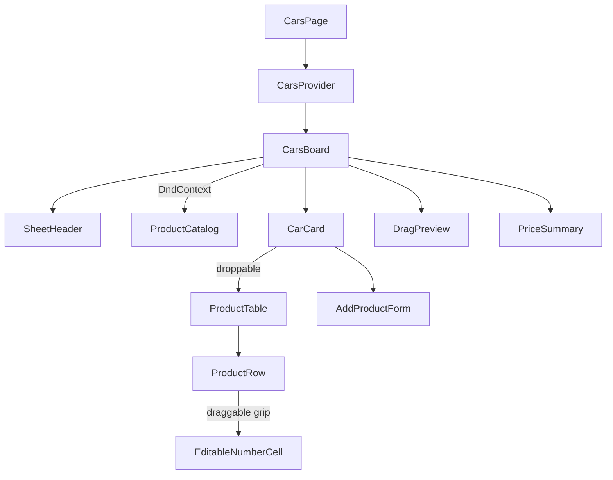
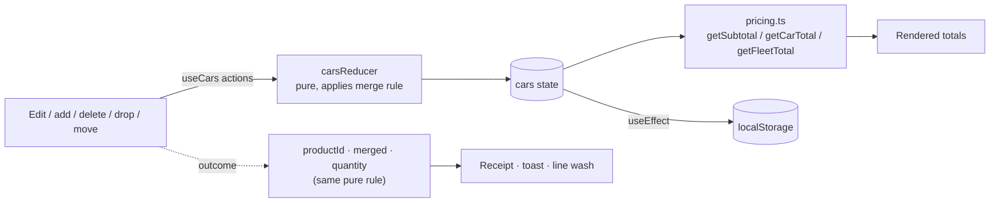

# Task 1 — Cars & Products

Route: `/cars` · Code: [`src/features/cars/`](../src/features/cars/) · Visual system: [DESIGN.md](../DESIGN.md)

## 1. Requirements → what was built

| Requirement | Implementation |
| --- | --- |
| Car: `id`, `name`, `products[]` · Product: `id`, `name`, `quantity`, `unitPrice` | [`types.ts`](../src/features/cars/types.ts) |
| List/grid of cars | A stack of **vehicle panels**, one per car. The header shows the name, line/unit count and **total**, even while folded. |
| Products table: Product Name \| Quantity \| Unit Price \| Subtotal | Dense table per vehicle: Line \| Qty \| Unit price, EGP \| Subtotal, EGP, with the total in the footer |
| Subtotal = quantity × unitPrice, total per car | [`lib/pricing.ts`](../src/features/cars/lib/pricing.ts), exact to the piaster |
| Add a product (name, quantity, price) + drag and drop | (a) drag a part from the **parts list** onto a vehicle, (b) the add-line form in each vehicle, (c) drag a line's grip onto another vehicle to move it |
| Inline edit of quantity/price, totals update live | `EditableNumberCell`: every valid keystroke is saved and every total counts to its new value |
| Delete a product | Trash button on each line |
| Quantity and price must be positive numbers | [`lib/validation.ts`](../src/features/cars/lib/validation.ts), with the error unfolding under the field |
| Print a summary of each car's items and the total (review feedback) | **Print summary** button in the page header → a print-only [`PriceSummary`](../src/features/cars/components/PriceSummary.tsx) sheet: every vehicle's lines, vehicle totals and the grand total |
| Adding a product the car already has increases its quantity (review feedback) | [`lib/merge.ts`](../src/features/cars/lib/merge.ts): same name + same price → quantities combine, for parts-list drops, the form and moves between vehicles |

## 2. Design

### The page

```
[EGIC] Operations toolkit      (●)━━━━━━━━(○)━━━━━━━━(○)                       (☀)
                          Cars & Products  National ID  Traders Map
╭──────────────────────────────────────────────────────────────────────────────╮
│ Cars & Products                                       ┄┄╮  pipe + car      │
│ brief…                                                  ┆  illustration    │
│ (Vehicles 4) (Lines 9) (Grand total, EGP 24,065.24)  Reset demo data        │
╰──────────────────────────────────────────────────────────────────────────────╯
╭ (#) Parts list  EGP ╮  ╭ (▣) Toyota Corolla 2023             Total, EGP  (˄) ╮
│ ⠿ Engine Oil 5W-30   │  │      3 lines · 4 units                 4,585.49       │
│   (4L)     1,250.00  │  ├────────────────────────────────────────────────────┤
│ ⠿ Oil Filter  185.50 │  │ Line                 Qty   Unit price   Subtotal     │
│ ⠿ …                  │  │ ⠿ 1 Engine Oil 5W-30 [ 2] [1250.00]   2,500.00  🗑   │
╰──────────────────────╯  │ Total  Σ of 3 lines                    4,585.49     │
                          │ ╭ Add line · part name ─ Qty ─ Unit price ─ (+ Add line) ╮
                          ╰────────────────────────────────────────────────────╯
                          ╭ (▣) Hyundai Elantra 2022                903.00  (˅) ╮
```

The page follows the toolkit's **Pipe Colour Code** world (see [DESIGN.md](../DESIGN.md)). Cars & Products runs on **supply green**: the active valve in the header, primary buttons, selection, the flash on a changed total and the wash on a changed line are all green. Each vehicle is a soft white panel (18px pipe-bend corners), controls are pills, and the header shows a flat drawing of a supply pipe feeding a car. The shell is soft but the tables stay dense, because staff price lines all day: every number uses tabular figures, is right-aligned and comparable down its column, and totals show what they sum.

| Signature detail | What it does |
| --- | --- |
| Stat chips in the header | Vehicles, lines and the grand total as pills; the grand total counts live |
| Σ caption + dimension bracket | "Σ of 3 lines" beside the total; hovering or focusing the total draws a green line down the subtotal column it sums |
| Parts list | A sticky price list of draggable parts; long names wrap on desktop; on phones, a horizontal strip |
| Line numbers | Each line carries its position number, as on an order sheet |
| Receipt line | After adding, the form states what happened: new line, or merged with the new quantity |
| Printed price summary | One A4 sheet: header with print time and counts, a table per vehicle (No. · Item · Qty · Unit price · Subtotal · Vehicle total), then a totals table ending in the grand total |

### Component tree



| Component | Role | Reads context? |
| --- | --- | --- |
| `CarsProvider` | Owns the cars state (reducer), returns merge outcomes, saves to `localStorage` | — |
| `CarsBoard` | Page layout, drag & drop orchestration, UI-only state (open panels, drag ghost, toast, drop flashes) | yes |
| `SheetHeader` (shared) | Page title, brief, stat chips, actions and the tool's illustration | no |
| `CarCard` | One vehicle panel: header with total, unfold, drop target, merge highlight for its form | yes |
| `ProductTable` / `ProductRow` | Dense table and lines; row motion (arrival, merge wash, removal, FLIP) | no |
| `EditableNumberCell` | Reusable inline number editor with validation and display formatting | no |
| `AddProductForm` | Validated add-line form with receipt; calls `onAdd(input)` and reads the outcome | no |
| `ProductCatalog` / `DragPreview` | Draggable parts list and the floating drag preview | no |
| `PriceSummary` | Print-only sheet built from `buildPriceSummary(cars)`; stamps the print time and names the PDF | no (gets `cars` as a prop) |

### Data flow



Totals are never stored. Each render computes them from `quantity` and `unitPrice`.

## 3. Technical details

### State management
- `useReducer` + React Context. [`carsReducer.ts`](../src/features/cars/state/carsReducer.ts) handles `ADD_PRODUCT`, `UPDATE_PRODUCT`, `DELETE_PRODUCT`, `MOVE_PRODUCT` and `RESET`.
- The reducer is pure and immutable. Cars that don't change keep the same object reference; a move onto the same car or an unknown car returns the original state.
- The context exposes named actions wrapped in `useCallback`; `addProduct` and `moveProduct` also **return an outcome** (`{ productId, merged, quantity }`) computed from the latest state with the same merge function the reducer uses. Components never call `dispatch` directly.
- UI-only state (which panels are open, the item being dragged, the toast, which line to wash) lives in `CarsBoard` / `CarCard`, not in the domain state.
- State loads from `localStorage` (falling back to seed data if missing or corrupt) and is saved on every change; storage errors are ignored and the app keeps working in memory.

### Duplicate lines (merge rule)
- A product counts as **the same** when its name matches (trimmed, whitespace collapsed, case-insensitive) **and** its unit price matches to the piaster ([`lib/merge.ts`](../src/features/cars/lib/merge.ts)).
- Same product → the existing line's quantity grows: **+1** for a parts-list drop, **+N** from the form, and **quantities combine** when a line is dragged onto a vehicle that already has it. The existing line keeps its id and position.
- Same name at a **different price** → a separate line, so a typed price is never silently discarded.
- Feedback: the form's receipt ("Oil Filter is already on this vehicle at this price — quantity is now 3"), a green wash on the merged line, and a toast that names the new quantity.

### Money calculations
JavaScript floats are imprecise: `0.1 * 3 === 0.30000000000000004`. [`pricing.ts`](../src/features/cars/lib/pricing.ts) therefore:
1. converts the unit price to integer **piasters** with `Math.round(price * 100)`,
2. multiplies and sums whole numbers only,
3. divides by 100 once at the very end.

`3 × 19.99 = 59.97` and `10 × 0.10 = 1.00` exactly (tested). Table columns format with `Intl.NumberFormat` to 2 decimals under an "EGP" header; prose and toasts use the full currency format.

### Validation
Validators take the **raw string** the user typed and return `{ ok: true, value } | { ok: false, error }`:

| Field | Rules |
| --- | --- |
| Quantity | required · digits only (rejects `1.5`, `1e2`) · > 0 · ≤ 1,000,000 |
| Unit price | required · a plain decimal (rejects `1e3`, `0x10`) · > 0 · at most 2 decimals · ≤ 100,000,000 |
| Part name (form) | required after trimming · ≤ 80 characters |

Inline editing (`EditableNumberCell`):
- Keeps the typed text as a local draft, so `12.` or an empty field while typing doesn't break anything.
- A valid value is saved on each keystroke, so totals update live. An invalid value shows a red border and an unfolding message and is **not** saved.
- On blur or Escape an invalid draft reverts to the last valid value with a brief amber flash; Enter confirms. Prices are shown with two decimals (`1250.00`) whenever you're not typing.
- If the value changes from outside (a merge, "Reset demo data"), the draft follows it.
- Uses `type="text"` + `inputMode="decimal|numeric"`: phones show a numeric keyboard and the validator sees exactly what was typed (`type="number"` silently reports `"1e"` as `""`).

The add-line form shows errors only after the first submit attempt, then updates them as you type. A rejected submit shakes the invalid fields and focuses the first one; a successful add resets the form, focuses the part name and shows the receipt.

### Drag & drop
- **@dnd-kit/core**: `useDraggable` on parts-list items and line grips, `useDroppable` on each vehicle panel.
- Drag data is typed (`{ type: 'catalog', template } | { type: 'product', carId, product }`), so `onDragEnd` switches on the type and never parses string IDs.
- Sensors: **mouse** starts after 5px of movement (clicks still work); **touch** after a 200ms press-and-hold (scrolling isn't hijacked); **keyboard** for accessible dragging.
- Collision detection uses the pointer position (the panel under the finger wins) and falls back to rectangle overlap for keyboard dragging.
- While dragging, valid targets get a dashed outline; the hovered panel grows slightly, gets a green border and ring, and says "Release to add to this vehicle". A line can't be dropped on its own vehicle.
- A drop opens the receiving panel, ripples its outline, washes the affected line and announces the result in an `aria-live` toast. Screen-reader announcements name the part and vehicle.

### Motion
| What | How |
| --- | --- |
| Panel unfold | Grid row `0fr ↔ 1fr` (no height measuring), content drifts into place; collapse is faster; folded controls are `inert` |
| Live totals | `AnimatedNumber` counts to the new value (interruptible, ease-out) with a flash of the tool colour (read from the computed `--accent`, so it is right in both themes); a timer always lands on the exact value |
| Lines | Arrival wash on new or moved lines, re-wash on merges, slide-out on delete, FLIP glide for the lines below |
| Drag | The dragged part tilts and lifts; drop target outline and ripple |
| Forms | Error messages unfold; invalid fields shake; the Add button's plus morphs into a check |

Every animation has a `prefers-reduced-motion` alternative that keeps colour and opacity feedback without movement.

### Printing
- **Print summary** calls `window.print()`, so staff get the browser's own dialog: pick a printer or **Save as PDF**. Ctrl+P gives the same result.
- The page renders the interactive board inside a `print:hidden` wrapper and the summary as `hidden print:block`, so one render tree serves both; the app header is hidden in print too. Collapsed vehicles still print in full because the summary doesn't depend on UI state.
- [`lib/summary.ts`](../src/features/cars/lib/summary.ts) builds the numbers with the same piaster-exact pricing functions as the page, so paper and screen always agree.
- `.price-sheet` pins a light palette and `color-scheme: light` in print, so printing from dark mode still gives a white page. `@page` sets A4 with 16/14 mm margins; vehicles and rows avoid page breaks inside them.
- On `beforeprint` the sheet stamps the real print time and sets the document title to `EGIC price summary YYYY-MM-DD`, which browsers use as the PDF file name; `afterprint` restores it.

### Responsive layout
- ≥1024px: sticky parts list (17rem) beside the vehicle panels.
- <1024px: the parts list becomes a horizontal scrolling strip above the vehicles; the grid uses `minmax(0,1fr)` so the strip can't widen the page.
- <640px: the table restyles into stacked label/value entries (same `<table>` markup, `block`/`flex`, per-field labels on mobile only). No duplicated inputs, no horizontal scrolling.

## 4. Decisions and why

| Decision | Choice | Why | Alternatives considered |
| --- | --- | --- | --- |
| State management | `useReducer` + Context | One feature with five actions doesn't need an external store. The reducer is still a pure, unit-tested function that could move to Redux or Zustand unchanged. | **Redux Toolkit / Zustand**: extra dependency and boilerplate. **`useState` per component**: updates spread out and harder to test. |
| Totals | Derived on render, never stored | A stored total can drift from its lines. Recomputing a few sums costs nothing. | Storing `total` and updating it in every action. |
| Money representation | Integer piasters inside calculations | Exact results without a decimal library. | **Floats**: rounding bugs. **decimal.js**: a dependency for 3 lines of integer maths. |
| Duplicate products | **Merge when name and price both match**; different price → separate line | Requested in review: adding a part a car already has should raise its quantity. Matching price too means no typed price is discarded and combined lines stay correct. | **Always a new row** (first version, reported wrong). **Merge by name, keep old price**: silently discards the price just entered. |
| Merge feedback | Outcome returned from the action | The form and drop handler know immediately whether a merge happened and which line to wash. | Diffing quantities in an effect after render: fragile and a render late. |
| Where state lives | Domain state in context, UI state local | Open panels or a toast aren't business data, and persisting them would be wrong. | Everything in one reducer. |
| Presentational vs connected | Only `CarsBoard` and `CarCard` read context | Table, row, cell and form are reusable (e.g. `EditableNumberCell` works for any number) and easy to reason about. | Every component calling `useCars()`. |
| Drag & drop library | **@dnd-kit/core** | Touch and keyboard support, which the mobile requirement makes important. Small, maintained, hooks-based. | **Native HTML5 DnD**: no touch. **react-beautiful-dnd**: deprecated. |
| Meaning of "add … drag and drop" | Parts list → vehicle, plus a form, plus line → another vehicle | Supports every reading of the requirement; the form doubles as the non-drag, accessible path. | Only one interpretation. |
| Visual form | **Soft vehicle panels around dense tables**, in supply green | The brief asked for a softer, warmer, more colourful look, but staff still compare figures across vehicles. So the softness lives in the shell (rounded panels, pill controls, an illustration) and the tables keep tight rows, hairline rules and tabular figures ([DESIGN.md](../DESIGN.md)). | The earlier ruled data-sheet sections (too austere); roomy cards with large figures (slower to scan). |
| Price display | Two decimals when not editing, raw while typing | Matches the subtotal column; typing stays free-form. | Always raw (`1250` next to `2,500.00` looked inconsistent). |
| Number inputs | `type="text"` + `inputMode` | Full control over validation and messages, plus a numeric keypad on phones. | `type="number"`: silent sanitising and spinners. |
| Persistence | `localStorage` | The demo survives reloads without a backend; "Reset demo data" makes it safe to experiment. | No persistence, or a backend (out of scope). |
| Print summary | **Print stylesheet + `window.print()`** | No dependency, works with every printer, and "Save as PDF" comes free from the browser. The summary is real HTML, so it is selectable and accessible. | **jsPDF / pdfmake**: a large dependency and a second layout to maintain. **Server-side PDF**: needs a backend. **Printing the screen as-is**: drag handles, inputs and collapsed vehicles make a poor document. |
| Table on mobile | Same `<table>` restyled as stacked entries | Keeps semantics, avoids duplicate inputs, no horizontal scrolling. | Horizontally scrolling table, or separate mobile markup. |

## 5. Testing

| File | What it proves |
| --- | --- |
| `lib/pricing.test.ts` | Subtotals and totals, float-drift cases (`0.1 × 3`, `3 × 19.99`, ten × 0.10), empty car = 0, grand total |
| `lib/validation.test.ts` | Accepted and rejected values with exact error messages (0, negatives, non-numeric, decimals in quantity, >2 decimals, `1e3`) |
| `lib/merge.test.ts` | Name normalisation, price compared to the piaster, different price ≠ same product, a line never merges into itself |
| `lib/summary.test.ts` | Printed summary: exact line subtotals, vehicle and grand totals, line/unit counts, empty vehicles kept in order, empty list |
| `state/carsReducer.test.ts` | Add, update, delete, move, immutability, untouched references, no-op moves, reset; merging on add, separate line on a different price, combining quantities on move |

Checked in the browser at desktop and 375 px, in light and dark: sample totals, live inline editing, error → revert on blur, the add form (rejected and accepted), merge receipts, delete, parts-list drop, moving a line between vehicles, reset, and no horizontal overflow. The print output was checked by printing `/cars` to PDF in headless Chrome with dark mode on: one white A4 page with all four vehicles and the grand total (24,065.24 for the demo data).

## 6. Assumptions and limitations

- Currency is EGP. Quantities are whole units. Prices have at most 2 decimals.
- The vehicles and the parts list are synthetic demo data. The task only asks to manage products, so vehicles can't be added or removed.
- Lines can't be reordered inside a vehicle (not requested).
- Data is kept per browser in `localStorage`.
