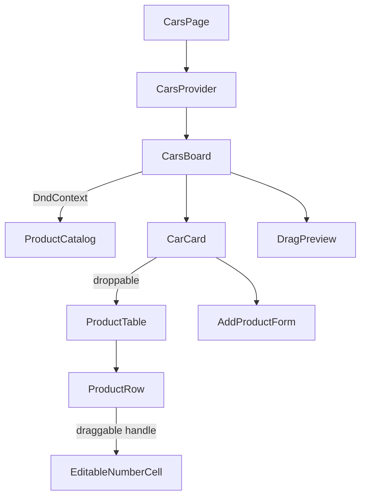
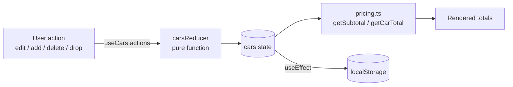

# Task 1 — Cars & Products

Route: `/cars` · Code: [`src/features/cars/`](../src/features/cars/)

## 1. Requirements → what was built

| Requirement | Implementation |
| --- | --- |
| Car: `id`, `name`, `products[]` · Product: `id`, `name`, `quantity`, `unitPrice` | [`types.ts`](../src/features/cars/types.ts) |
| List/grid of cars | Expandable car cards. The header shows the name, product/unit count and **total**, even while collapsed. |
| Products table: Product Name \| Quantity \| Unit Price \| Subtotal | `ProductTable` + `ProductRow`, with the car total in the table footer |
| Subtotal = quantity × unitPrice, total per car | [`lib/pricing.ts`](../src/features/cars/lib/pricing.ts), exact to the piaster |
| Add a product (name, quantity, price) + drag and drop | (a) drag a catalog item onto a car, (b) a form in each car, (c) drag a product row onto another car to move it |
| Inline edit of quantity/price, totals update live | `EditableNumberCell`: every valid keystroke is saved and all totals re-render |
| Delete a product | Trash button on each row |
| Quantity and price must be positive numbers | [`lib/validation.ts`](../src/features/cars/lib/validation.ts), with the error shown next to the field |

## 2. Design

### Component tree

| Component | Role | Reads context? |
| --- | --- | --- |
| `CarsProvider` | Owns the cars state (reducer) and saves it to `localStorage` | — |
| `CarsBoard` | Page layout, drag & drop orchestration, UI-only state (expanded cards, drag preview, toast) | yes |
| `CarCard` | One car: header with totals, expand/collapse, drop target | yes |
| `ProductTable` / `ProductRow` | Display and edit products. Receive data + callbacks only | no |
| `EditableNumberCell` | Reusable inline number editor with validation | no |
| `AddProductForm` | Validated form. Calls `onAdd(input)` | no |
| `ProductCatalog` / `DragPreview` | Draggable templates and the floating drag ghost | no |

### Data flow

Totals are never stored. Each render computes them from `quantity` and `unitPrice`.

## 3. Technical details

### State management
- `useReducer` + React Context. [`carsReducer.ts`](../src/features/cars/state/carsReducer.ts) handles `ADD_PRODUCT`, `UPDATE_PRODUCT`, `DELETE_PRODUCT`, `MOVE_PRODUCT` and `RESET`.
- The reducer is pure and immutable. Cars that don't change keep the same object reference, and a move onto the same car or an unknown car returns the original state.
- The context exposes named actions (`addProduct`, `updateProduct`…) wrapped in `useCallback`, and the value is wrapped in `useMemo`. Components never call `dispatch` directly.
- UI-only state (which cards are expanded, the item being dragged, the toast) lives in `CarsBoard`, not in the domain state.
- State loads from `localStorage` (falling back to the seed data if it's missing or corrupt) and is saved on every change. Storage errors (private mode, quota) are ignored, and the app keeps working in memory.

### Money calculations
JavaScript floats are imprecise: `0.1 * 3 === 0.30000000000000004`. [`pricing.ts`](../src/features/cars/lib/pricing.ts) therefore:
1. converts the unit price to integer **piasters** with `Math.round(price * 100)`,
2. multiplies and sums whole numbers only,
3. divides by 100 once at the very end.

`3 × 19.99 = 59.97` and `10 × 0.10 = 1.00` exactly. Both are covered by tests. Display uses `Intl.NumberFormat` with EGP and 2 decimals.

### Validation
Validators take the **raw string** the user typed and return `{ ok: true, value } | { ok: false, error }`:

| Field | Rules |
| --- | --- |
| Quantity | required · digits only (rejects `1.5`, `1e2`) · > 0 · ≤ 1,000,000 |
| Unit price | required · a plain decimal (rejects `1e3`, `0x10`) · > 0 · at most 2 decimals · ≤ 100,000,000 |
| Name (form) | required after trimming · ≤ 80 characters |

Inline editing (`EditableNumberCell`):
- Keeps the typed text as a local draft, so `12.` or an empty field while typing doesn't break anything.
- A valid value is saved on each keystroke, so totals update live. An invalid value shows a red border and message and is **not** saved.
- On blur or Escape an invalid draft goes back to the last valid value. Enter confirms.
- If the value changes from outside (e.g. "Reset demo data"), the draft follows it.
- Uses `type="text"` + `inputMode="decimal|numeric"`: phones show a numeric keyboard, and the validator sees exactly what was typed. (`type="number"` silently reports `"1e"` as `""`.)

The add form shows errors only after the first submit attempt, then updates them as the user types. After a successful add it resets and focuses the name field for quick entry.

### Drag & drop
- **@dnd-kit/core**: `useDraggable` on catalog items and row grip handles, `useDroppable` on each car card.
- Drag data is typed (`{ type: 'catalog', template } | { type: 'product', carId, product }`), so `onDragEnd` switches on the type and never parses string IDs.
- Sensors: **mouse** starts after moving 5px, so clicks still work; **touch** starts after a 200ms press-and-hold, so scrolling on phones isn't hijacked; the **keyboard** sensor makes dragging accessible.
- Collision detection uses the pointer position (the card under the finger wins) and falls back to rectangle overlap for keyboard dragging.
- While dragging, every valid target gets a dashed outline, and the hovered card gets a ring. A product can't be dropped on its own car.
- A drop onto a collapsed car expands it and shows a toast ("Added Oil Filter to …") in an `aria-live` region. Screen-reader announcements are customised with product and car names.

### Responsive layout
- ≥1024px: sticky catalog sidebar + list of cars.
- <1024px: the catalog becomes a horizontal scrolling strip above the cars. The grid uses `minmax(0,1fr)` so the strip can't widen the page.
- <640px: the table turns into stacked cards (the same `<table>` markup restyled with `block`/`flex`, with per-field labels shown on mobile only). Inputs aren't duplicated, and it never scrolls horizontally.

## 4. Decisions and why

| Decision | Choice | Why | Alternatives considered |
| --- | --- | --- | --- |
| State management | `useReducer` + Context | One feature with five actions doesn't need an external store. The reducer is still a pure, unit-tested function and could move to Redux or Zustand unchanged. | **Redux Toolkit / Zustand**: extra dependency and boilerplate for no benefit at this size. **`useState` in each component**: state updates spread out and harder to test. |
| Totals | Derived on render, never stored | A stored total can drift from its products. Recomputing a sum over a few rows costs nothing. | Storing `total` on the car and updating it in every action. |
| Money representation | Integer piasters inside calculations | Exact results without a decimal library. | **Floats**: rounding bugs. **decimal.js**: a dependency for something 3 lines of integer maths can do. |
| Where state lives | Domain state in context, UI state local to `CarsBoard` | Expanding a card or showing a toast isn't business data, and saving it would be wrong. | Everything in one reducer. |
| Presentational vs connected components | Only `CarsBoard` and `CarCard` read context. Table, row, cell and form take props. | The table, cell and form are reusable (e.g. `EditableNumberCell` works for any number) and easy to reason about. | Every component calling `useCars()`, which couples them all to this one feature. |
| Drag & drop library | **@dnd-kit/core** | Supports touch and keyboard, which the mobile requirement makes important. Small, maintained, and uses hooks. | **Native HTML5 DnD**: doesn't work on touch devices. **react-beautiful-dnd**: deprecated. **@dnd-kit/sortable**: not needed, since rows aren't reordered. |
| Meaning of "add … drag and drop" | Catalog → car, plus a form, plus product → another car | The requirement can be read several ways. Supporting all three satisfies each reading, and the form doubles as a non-drag option for accessibility. | Only one of the interpretations. |
| Catalog drop behaviour | Always adds a new row (quantity 1, catalog price) | Predictable, and matches "add a new product". The user edits the quantity inline. | Merging into an existing row with the same name: surprising when prices differ. |
| Number inputs | `type="text"` + `inputMode` | Full control over validation and messages, plus a numeric keypad on phones. | `type="number"`: browsers sanitise the value silently and show spinners. |
| Persistence | `localStorage` | The demo survives reloads without a backend. "Reset demo data" makes it safe to experiment. | No persistence (edits lost on refresh), or a backend (out of scope). |
| Table on mobile | Same `<table>` restyled as cards | Keeps table semantics on desktop, avoids duplicate inputs, and needs no horizontal scrolling. | A horizontally scrolling table (poor on phones), or rendering separate mobile markup. |

## 5. Testing

| File | What it proves |
| --- | --- |
| `lib/pricing.test.ts` | Subtotals and totals, float-drift cases (`0.1 × 3`, `3 × 19.99`, ten × 0.10), empty car = 0, grand total |
| `lib/validation.test.ts` | Accepted and rejected values with exact error messages (0, negatives, non-numeric, decimals in quantity, >2 decimals, `1e3`) |
| `state/carsReducer.test.ts` | Add, update, delete and move, immutability, untouched references, no-op moves, reset |

Checked by hand in the browser: the sample totals, live inline editing, error → revert on blur, the add form, delete, catalog drop, moving a row between cars, reset, and the 375px layout.

## 6. Assumptions and limitations

- Currency is EGP. Quantities are whole units. Prices have at most 2 decimals.
- The cars themselves are sample data. The task only asks to manage products, so there is no add or remove for cars.
- Rows can't be reordered inside a car (not requested).
- Data is kept per browser in `localStorage`.
