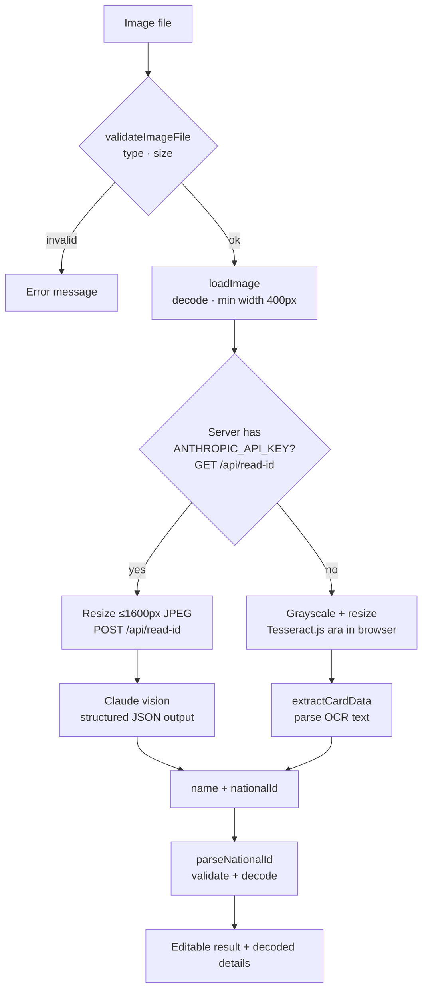

# Task 2 — Egyptian National ID Reader

Route: `/national-id` · Code: [`src/features/national-id/`](../src/features/national-id/), [`server/idReaderPlugin.ts`](../server/idReaderPlugin.ts)

## 1. Requirements → what was built

| Requirement | Implementation |
| --- | --- |
| Input: the ID card as an image | Click-to-upload or drag & drop (JPG/PNG/WebP, ≤10 MB), plus a **"Try a sample card"** button that generates a fictional card, so nobody needs to upload a real ID |
| Output: name and national ID as text | Editable text fields filled from the image, so OCR mistakes can be corrected |
| Correct parsing | Claude vision reads the card. The 14-digit number is then validated and **decoded** (birth date, age, gender, governorate) by a unit-tested parser |
| Input validation & error handling | File type/size/dimension checks, ID structure validation with specific messages, and clear errors for network, API and OCR failures |
| Comments explaining the ID structure | Documented at the top of [`nationalId.ts`](../src/features/national-id/lib/nationalId.ts) (and in §3 below) |

## 2. Design

### Pipeline



### Modules

| Module | Responsibility | Runs in |
| --- | --- | --- |
| [`lib/nationalId.ts`](../src/features/national-id/lib/nationalId.ts) | ID structure docs, digit normalisation, `parseNationalId` (validate + decode) | anywhere (pure) |
| [`lib/extractCardData.ts`](../src/features/national-id/lib/extractCardData.ts) | Finds the ID and name in raw OCR text (Tesseract fallback) | anywhere (pure) |
| [`lib/cardReader.ts`](../src/features/national-id/lib/cardReader.ts) | Picks the engine, calls it, and returns the same result shape either way | browser |
| [`lib/ocr.ts`](../src/features/national-id/lib/ocr.ts) | Image validation, decoding, canvas resizing, Tesseract worker | browser |
| [`lib/readerApi.ts`](../src/features/national-id/lib/readerApi.ts) | Typed request/response contract shared by browser and server | both |
| [`server/idReaderPlugin.ts`](../server/idReaderPlugin.ts) | `/api/read-id`: validates the request, calls Claude, maps errors | Node (Vite server) |
| [`lib/sampleCard.ts`](../src/features/national-id/lib/sampleCard.ts) | Draws a fictional card on a canvas for demos | browser |
| `components/ImageDropzone`, `components/IdResult`, `pages/NationalIdPage` | Upload UI, result/decoding UI, the scan state machine | browser |

The page tracks one state value with four cases: `idle | processing (step, progress) | done (engine, warnings) | error (message)`. The upload is disabled while a scan runs, so results from two overlapping scans can never mix.

## 3. The Egyptian national ID number

```
   2  900101  01  2345  6
   │    │      │    │   └─ 14      check digit (algorithm not officially published)
   │    │      │    └───── 10–13   birth-registration sequence; the 13th digit is the gender:
   │    │      │                   odd = male, even = female
   │    │      └────────── 8–9     governorate of birth (88 = born outside Egypt)
   │    └───────────────── 2–7     birth date YYMMDD
   └────────────────────── 1       century: 2 = 1900–1999, 3 = 2000–2099
```

Governorate codes: 01 Cairo, 02 Alexandria, 03 Port Said, 04 Suez, 11 Damietta, 12 Dakahlia, 13 Sharqia, 14 Qalyubia, 15 Kafr El Sheikh, 16 Gharbia, 17 Monufia, 18 Beheira, 19 Ismailia, 21 Giza, 22 Beni Suef, 23 Faiyum, 24 Minya, 25 Asyut, 26 Sohag, 27 Qena, 28 Aswan, 29 Luxor, 31 Red Sea, 32 New Valley, 33 Matrouh, 34 North Sinai, 35 South Sinai, 88 abroad.

On the card the number is printed in **Arabic-Indic digits** (٠١٢٣٤٥٦٧٨٩). `normalizeDigits` converts them (and Persian ۰-۹) to 0-9 before any check.

`parseNationalId` checks each of these, in order, with a specific message for each failure:

1. Not empty, digits only (spaces and dashes are ignored), exactly 14 digits
2. Century digit is 2 or 3
3. The birth date is a **real calendar date**. JS `Date` silently rolls Feb 30 over to Mar 2, so the result is compared back against the input.
4. The birth date is not in the future
5. The governorate code is known

It returns the decoded fields: birth date (ISO and `Date`), age (accounting for whether this year's birthday has passed), gender, governorate (English + Arabic), sequence, and check digit.

The **check digit is displayed but not verified.** There is no official public algorithm, and rejecting valid IDs based on a guessed formula would be worse than not checking.

## 4. Reading the card: engines

### Claude vision (primary)
- The browser resizes the image to at most 1600px on the long edge, as a JPEG at quality 0.9, then POSTs it as base64. Larger images cost more tokens without reading better.
- The server calls `claude-opus-5` with:
  - a **system prompt** describing the card layout: two name lines, the address below, and the Arabic-Indic ID number with its dot-shaped zero; plus "never guess digits".
  - **structured outputs** (`output_config.format` with a JSON schema: `is_id_card_front`, `name`, `national_id`). The API guarantees the reply matches the schema, so there's no fragile text parsing.
  - **`effort: "medium"`**: a perception task that doesn't need deep reasoning, which keeps scans fast.
  - **server-side refusal fallback** (`fallbacks: "default"`, beta `server-side-fallback-2026-07-01`): if the model declines a request, the API retries it on Anthropic's recommended fallback model within the same call. A refusal that still happens is reported as an error.
- Errors are matched to typed SDK exceptions and turned into user messages: invalid key → 500, rate limit → 429, bad image → 400, anything else → 502. Details are logged on the server, and nothing sensitive is sent to the browser.
- The request body is capped at 8 MB, and the media type must be JPEG, PNG or WebP.
- Rough cost: about 2–3K input tokens (image + prompt) and a few hundred to ~1K output tokens per scan, so a few cents at Opus 5 prices. This is an estimate.

### Tesseract.js (fallback, no key)
- Used when `GET /api/read-id` reports no key, or when the endpoint doesn't exist (e.g. static hosting).
- Arabic model (`ara`) running in a web worker. The model downloads from jsDelivr on first use and is cached by the browser. The image is resized to 1800px wide and converted to high-contrast grayscale.
- [`extractCardData.ts`](../src/features/national-id/lib/extractCardData.ts) parses the noisy text:
  - **ID:** each line is reduced to its digits, and every 14-digit window is tested with `parseNationalId`. The first structurally valid one wins. Otherwise a raw 14-digit run is returned for the user to correct.
  - **Name:** the first two clean Arabic lines, skipping the header ("جمهورية مصر العربية", "بطاقة تحقيق الشخصية") and noise fragments, and stopping at the address (a line with digits or address words such as شارع, قسم, مركز).

### Why Claude is primary (measured, not assumed)

The first version used only Tesseract, because it needs no key and no server. Testing it on a clean generated card showed it isn't good enough:

| Tried | Result |
| --- | --- |
| Page segmentation modes 3, 4, 6, 11 · original vs 1800px grayscale | Header, first name and address lines read. **The second name line was never read.** |
| The ID line cropped, PSM 7, at 1× and 2× | Digits came back as Latin lookalikes, e.g. `19641.11 01` for `٢٩٠٠١٠١٠١٢٣٤٥٦`. The Arabic-Indic zero is a small dot and gets dropped. |
| A whitelist of Arabic-Indic digits only | Empty output |
| `best_int` vs `4.0.0` Arabic model files | Same failures |

The ID number is the main output of this task, and Tesseract couldn't read it even from an ideal synthetic image. Real phone photos would be worse. Claude reads Arabic names and Arabic-Indic digits reliably, so it became the primary engine, and Tesseract stayed as a zero-setup fallback. The UI tells the user which engine read the card and warns that the fallback is unreliable.

## 5. Decisions and why

| Decision | Choice | Why | Alternatives considered |
| --- | --- | --- | --- |
| Reading engine | **Claude vision, with Tesseract.js fallback** | Accuracy matters most here (see §4). The fallback keeps the page usable for a reviewer without an API key. | **Tesseract only**: measured as unable to read the ID digits. **Google Cloud Vision / Azure OCR**: also need keys and billing, and return raw text that still needs the same fragile parsing. **Custom models (YOLO + EasyOCR)**: a Python ML pipeline, far beyond this scale. |
| Where the API key lives | **Server only** (Vite middleware) | A key in browser code can be stolen by anyone who opens the page. | Calling the API from the browser, which exposes the key. |
| Server shape | **A Vite plugin** that adds middleware to `dev` and `preview` | No second process, port, CORS setup or proxy. `npm run dev` runs everything. About 150 lines. | Express/Fastify server: extra process and setup. Next.js: a framework switch for one endpoint. For production hosting, the same `readIdCard` function would move to a serverless function. |
| Output format | **Structured outputs (JSON schema)** | The response is guaranteed to match the schema, so there's no regex over model prose. | Asking for JSON in the prompt and hoping. Tool use just to get JSON. |
| Model and effort | `claude-opus-5`, `effort: "medium"` | The most capable Opus model reads small Arabic text and dotted zeros best. Medium effort keeps the scan responsive for a simple extraction. | Higher effort: slower, with no benefit expected for reading a card. |
| Validate after reading | The **same `parseNationalId`** runs on whatever either engine returns | A model can still misread one digit. The structure check (century, real date, governorate) catches most such errors whichever engine was used. | Trusting the engine's output. |
| Editable results | Name and ID are inputs, and decoding updates live as you type | OCR is never perfect. Letting the user fix one character beats rescanning, and the fix is validated immediately. | Read-only text. |
| Check digit | Shown, **not verified** | No official algorithm. A guessed formula could reject real IDs. | Implementing an unofficial checksum. |
| Image preprocessing | Claude: resize to ≤1600px JPEG. Tesseract: 1800px grayscale with contrast | Claude doesn't need filters, and smaller uploads are faster and cheaper. Tesseract benefits from larger, high-contrast input. | Heavier OpenCV-style preprocessing (deskew, threshold): big dependency, and it didn't fix the digit problem. |
| Sample card | Generated on a canvas with fictional data | Reviewers can try the flow without using a real person's ID. No binary asset in the repo. | Shipping a real ID photo (a privacy problem), or none (harder to evaluate). |
| Tesseract worker lifetime | New worker per scan, terminated after | Scans are rare. Keeping a worker (and its model) alive wastes memory. | A long-lived singleton worker. |
| Concurrency | Upload disabled while scanning | The simplest way to prevent overlapping scans from racing. | Cancellation tokens or ignoring stale results: more code for no user benefit. |

## 6. Validation & error handling

| Stage | Check | User sees |
| --- | --- | --- |
| File | Type is JPG/PNG/WebP | "Please upload a JPG, PNG or WebP image." |
| File | Size ≤ 10 MB | "The image is larger than 10 MB…" |
| Decode | The file is a valid image | "The file could not be read as an image." |
| Decode | Width ≥ 400px | "The image is too small (Npx wide)…" |
| Server | Body ≤ 8 MB, valid JSON, allowed media type | 413 / 400 with a message |
| Server | Key missing / invalid / rate-limited / model declined / other | 503 / 500 / 429 / 502 with a readable message |
| Network | Server unreachable | "Could not reach the server…" |
| Tesseract | Engine or model failed to load | "On-device OCR failed to start… check your internet connection" |
| Result | Not an ID card front (Claude), name or ID not found | Amber warning with tips; the fields stay editable |
| ID | The 5 structural checks in §3 | Specific inline error under the ID field |

## 7. Testing

| File | What it proves |
| --- | --- |
| `lib/nationalId.test.ts` | Decoding male and female, 1900s and 2000s IDs; age before and after the birthday; Arabic-Indic input; every rejection message (length, non-digits, century, Feb 30, month 13, future date, unknown governorate) |
| `lib/extractCardData.test.ts` | ID found in noisy OCR text, split digits joined, valid window picked from a longer run, invalid fallback, name extracted while skipping header, noise and address, diacritics stripped |

Checked live in the browser:
- **No key:** the endpoint reports `available: false`, the sample card goes through Tesseract, and the missing ID is flagged with a warning. Typing an Arabic-Indic ID decodes live. An invalid date shows its error. Uploading a `.txt` file is rejected.
- **With a deliberately invalid key** (preview server): the endpoint reports `available: true`, bad input returns 400, and the full browser → server → Anthropic request ran, with the 401 shown as "The server API key is invalid."
- A real Claude read wasn't run locally because no API key was available during development. Add a key to verify end to end.

## 8. Assumptions and limitations

- Only the **front** of the card is read. It holds the name and number; the back (job, marital status, expiry) wasn't requested.
- With Claude enabled, the image is sent to Anthropic's API to be read. The app itself never stores it. Without a key, nothing leaves the browser.
- The Tesseract fallback is best-effort and often needs manual correction, as the UI says.
- The endpoint exists in `vite dev` / `vite preview`. A static production host would need the handler moved to a serverless function; until then, the page automatically uses the fallback.
