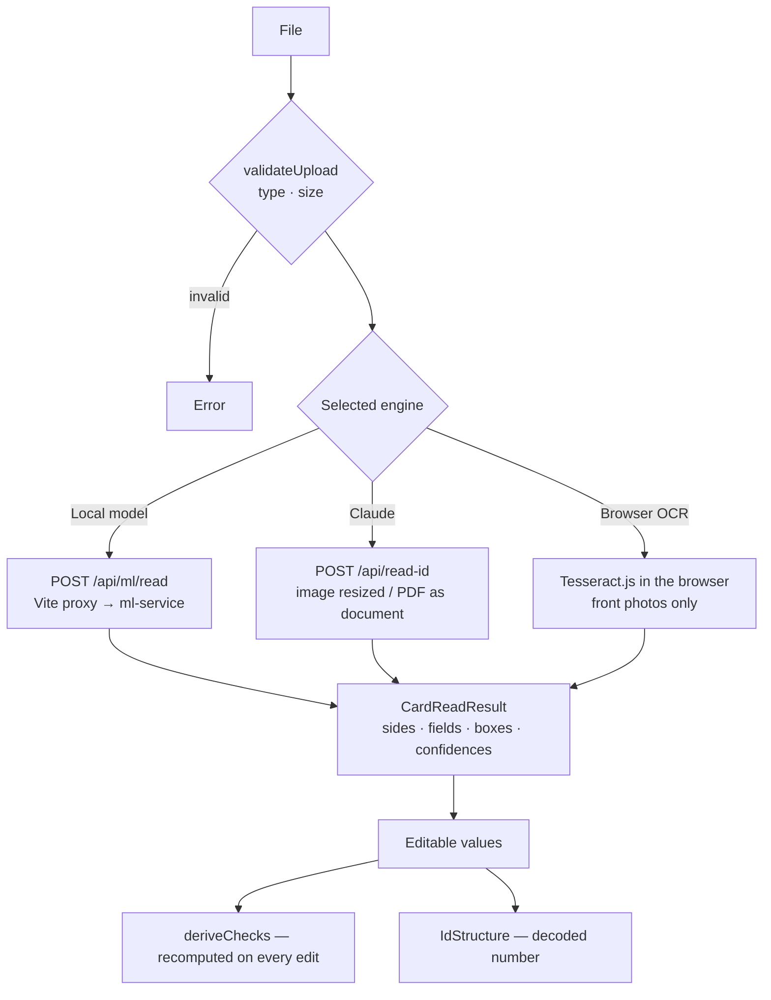

# Task 2 — Egyptian National ID Reader

Route: `/national-id` · Code: [`src/features/national-id/`](../src/features/national-id/), [`ml-service/`](../ml-service/) (local deep-learning engine), [`server/idReaderPlugin.ts`](../server/idReaderPlugin.ts) (Claude engine) · Visual system: [DESIGN.md](../DESIGN.md) · Service setup: [ml-service/README.md](../ml-service/README.md)

## 1. Requirements → what was built

| Requirement | Implementation |
| --- | --- |
| Input: the ID card as an image | Photo (JPG/PNG/WebP) **or PDF scan**, front, back or both sides on one page; drop or click to upload, plus a fictional "Try a sample card" |
| Output: name and national ID as text | Name and 14-digit number as editable text, plus the other printed fields: address, card number, profession, gender, religion, marital status, issue and expiry dates |
| Correct parsing | A **local deep-learning OCR service** (CRAFT detector + Arabic CRNN) reads the card; every number is validated and decoded; front and back are cross-checked |
| Input validation & error handling | File type/size/dimension checks in the browser and the service, per-engine availability, readable errors for every failure, live checks with pass / check / fail stamps |
| Comments explaining the ID structure | [`nationalId.ts`](../src/features/national-id/lib/nationalId.ts) and its Python mirror [`national_id.py`](../ml-service/app/national_id.py); §4 below |

## 2. Design

### The sheet

```
┌ Source document ─────────────────────────┐ ┌ Extracted data ────────────────────────────┐
│ Reading engine  [Local model|Claude|OCR] │ │ No. Field        Value (editable)   Conf.  │
│                                          │ │ ①  Name          محمد …             91%   │
│  Front side                              │ │ ②  Address       ١٥ …               81%   │
│  ┌────────────────────────────┐          │ │ ③  National ID   2 9 …              99%   │
│  │ card image  ①──┐ ②──┐      │          │ │ …                                           │
│  │             ③──┘ ④         │          │ │ Cross-checks  PASS ID structure            │
│  └────────────────────────────┘          │ │               PASS Front ↔ back            │
│  Back side  ⑤ ⑥ ⑦ ⑧ ⑨ ⑩                 │ │ National number, decoded  2 | 990101 | …   │
└──────────────────────────────────────────┘ └────────────────────────────────────────────┘
```

Every extracted value carries a **numbered balloon**: the same number sits on the text the model located on the card image and on the row in the fields table; hovering either lights both. Staff can verify any value against its source at a glance — the product principle "exactness is visible".

### Flow



### Modules

| Module | Responsibility | Runs in |
| --- | --- | --- |
| [`lib/cardReader.ts`](../src/features/national-id/lib/cardReader.ts) | Engine availability probe, the three engine adapters, one normalised result shape | browser |
| [`lib/cardFields.ts`](../src/features/national-id/lib/cardFields.ts) | Field schema (order, labels, side), `deriveChecks` | anywhere (pure) |
| [`lib/nationalId.ts`](../src/features/national-id/lib/nationalId.ts) | ID structure, digit normalisation, validation + decoding | anywhere (pure) |
| [`lib/extractCardData.ts`](../src/features/national-id/lib/extractCardData.ts) | Parses Tesseract's raw text (browser fallback) | anywhere (pure) |
| [`lib/fieldRows.ts`](../src/features/national-id/lib/fieldRows.ts) | Merges fields read on both sides into numbered rows | anywhere (pure) |
| `components/EngineSelector`, `DocumentView`, `ExtractedFields`, `ChecksTable`, `IdStructure` | The sheet's parts | browser |
| [`ml-service/app/*`](../ml-service/app/) | Documents → deep-learning OCR → layout → fields → checks | Python service |
| [`server/idReaderPlugin.ts`](../server/idReaderPlugin.ts) | Claude endpoint (key server-side, structured output) | Vite dev/preview server |

## 3. The engines

| | **Local model** (default when running) | **Claude** (optional) | **Browser OCR** (fallback) |
| --- | --- | --- | --- |
| Model | EasyOCR: **CRAFT** text detector + **CRNN** Arabic recognizer (PyTorch), CUDA when available | Claude Opus 5 vision, structured JSON output | Tesseract.js `ara` |
| Needs | Python service on this machine | `ANTHROPIC_API_KEY` | nothing |
| Input | photos + PDFs, both sides | photos + PDFs, both sides | front photos |
| Output | fields + **text locations** + **confidences** + card-side crops | fields | name + ID only, raw text |
| Privacy | stays on the PC | sent to Anthropic | stays in the browser |
| Measured on a real two-sided card | **all 10 fields correct**, both IDs agree, 4/4 checks pass, ~3 s on an RTX 3060 | not run (no key during development) | ID digits unreadable, second name line missed (on a clean synthetic card) |

### Local model pipeline (details in [ml-service/README.md](../ml-service/README.md))

1. **Documents.** PDFs render at 250 DPI (first two pages); photos decode with OpenCV, capped at 3000 px.
2. **Deep learning.** CRAFT finds every text region on the page; the Arabic CRNN reads each one.
3. **Layout.** Regions → lines (vertical overlap) → cards (large vertical gaps) → front/back by anchor words (بطاقة تحقيق الشخصية on the front; البطاقة سارية / gender and religion words on the back).
4. **Fields by printed layout.** Front: two name lines after the header, address lines before the number, the 14-digit ID, the Latin card number. Back: ID + issue date on the top line, profession lines, gender · religion · marital status, expiry.
5. **Targeted re-reads** fix what a single pass gets wrong, each driven by an observed failure on the real sample:
   - digit groups come back in right-to-left display order → both orders are tried, plus a digits-only re-read sorted left to right;
   - small name/address text → re-read enlarged 2× in greyscale, keeping whichever reading is more confident or more complete;
   - the model reads the "/" in dates as "١" → date parsing expects that, prefers expiry = issue year + 7 (the card's validity);
   - a split house number ("٥ ١") → rejoined;
   - one-letter misreads of the four most frequent given names (e.g. محمل → محمد) below 95 % line confidence → repaired and **shown to the user as a note**; names near a frequent name that are real names in their own right are protected.
6. **Checks** (returned by the service for direct callers; the web app recomputes them live, §5).

## 4. The Egyptian national ID number

```
   2  990101  21  0139  5
   │    │      │    │   └─ 14      check digit (algorithm not officially published)
   │    │      │    └───── 10–13   birth-registration sequence; the 13th digit is the gender:
   │    │      │                   odd = male, even = female
   │    │      └────────── 8–9     governorate of birth (88 = born outside Egypt)
   │    └───────────────── 2–7     birth date YYMMDD
   └────────────────────── 1       century: 2 = 1900–1999, 3 = 2000–2099
```
*(Illustrative digits.)* Governorate codes: 01 Cairo, 02 Alexandria, 03 Port Said, 04 Suez, 11 Damietta, 12 Dakahlia, 13 Sharqia, 14 Qalyubia, 15 Kafr El Sheikh, 16 Gharbia, 17 Monufia, 18 Beheira, 19 Ismailia, 21 Giza, 22 Beni Suef, 23 Faiyum, 24 Minya, 25 Asyut, 26 Sohag, 27 Qena, 28 Aswan, 29 Luxor, 31 Red Sea, 32 New Valley, 33 Matrouh, 34 North Sinai, 35 South Sinai, 88 abroad.

Printed with Arabic-Indic digits (٠-٩), normalised before any check. Validation, in order: digits only · 14 digits · century 2 or 3 · a real calendar date (JS `Date` rollover guarded) · not in the future · a known governorate. The check digit is shown but not verified: there is no official public algorithm.

## 5. Checks, recomputed live

[`deriveChecks`](../src/features/national-id/lib/cardFields.ts) runs on the **current field values**, so correcting a misread digit or a gender value re-stamps the verdicts immediately:

| Check | Pass | Check (warn) | Fail |
| --- | --- | --- | --- |
| ID structure | valid structure | — | parser's exact error |
| Front ↔ back | same number on both sides | — | the two numbers differ |
| Gender ↔ ID digit | card word matches the 13th digit | they disagree | — |
| Card validity | expiry in the future | expired | — |

## 6. Decisions and why

| Decision | Choice | Why | Alternatives considered |
| --- | --- | --- | --- |
| Reading engine | **Local deep-learning service first, Claude optional, Tesseract fallback** | Asked for a deep-learning reader. A local pretrained detector + recognizer read the real card correctly with no API key and no data leaving the PC; Claude stays available for machines without Python/GPU; Tesseract keeps the page usable with zero setup. | **Tesseract only**: measured unable to read the digits. **Claude only**: needs a key, sends ID images to a third party. **Train a custom model**: needs a labelled dataset of real IDs we don't have. |
| Model family | **EasyOCR (CRAFT + CRNN)** | Pretrained Arabic recognizer that reads Arabic-Indic digits, runs on PyTorch with CUDA, pip-installable on Windows. | **PaddleOCR**: strong, but heavier Windows/GPU setup. **TrOCR/Donut-style transformers**: need fine-tuning on ID data. **YOLO field detector**: needs labelled boxes. |
| Service shape | **Separate FastAPI process, proxied by Vite at `/api/ml`** | PyTorch can't run in Node; a small HTTP service keeps the model warm (loads once, ~3 s) and the web app same-origin. | Spawning Python per request: reloads the model every time. Running the model in the browser (ONNX): large download, weaker Arabic models. |
| Where layout logic lives | **Pure Python functions with tests** (layout, fields) separate from model calls | Every repair is testable without a GPU; the pipeline composes them. | Inline heuristics in one script: untestable. |
| Heuristics vs. overfitting | Rules encode the **card's printed layout and the model's systematic errors**, never the sample's content | One real sample was available; rules based on what every card prints (header anchor, two name lines, "/" misread) generalise, content-specific rules would not. Stated as a limitation. | Tuning thresholds to one card's words. |
| Name repair | Auto-repair only the four most frequent given names, below 95 % confidence, one letter away, with a visible note | Fixes a common, verifiable misread without "correcting" real names; staff see and can undo it. | No repair (known-wrong output); fuzzy matching against a large lexicon (would rewrite real names). |
| Checks location | **Recomputed in the browser from current values** | Corrections re-validate instantly for every engine, including Claude and Tesseract which return no checks. | Showing the service's checks: stale after the first edit. |
| Field ↔ source link | **Numbered balloons on located text + table rows** | Makes every value verifiable against the card; uses the service's normalised boxes. | Plain list of values: no way to see where a value came from. |
| PDF input | Local model renders pages; Claude receives the PDF as a document; Tesseract declines | The sample arrives as a PDF with both sides; each engine handles it natively instead of a client PDF renderer. | pdf.js in the browser: another large dependency. |
| Privacy | Uploads processed in memory, never stored; sample ID never committed | ID documents are personal data. | — |

## 7. Validation & error handling

| Stage | Check | User sees |
| --- | --- | --- |
| Browser | type JPG/PNG/WebP/PDF, ≤ 10 MB | "Upload a JPG, PNG or WebP photo, or a PDF scan." / size message |
| Engine | availability probed; unavailable engines disabled with the reason | "Service not running (see README)", "No API key on the server" |
| Browser OCR + PDF | not supported | switches to an engine that can, or explains |
| Service | decodable, ≥ 500 px short side, ≤ 15 MB, PDF opens | 400 with a specific message |
| Service | model failure | 500 "The model could not read this document." (details logged) |
| Network | service/endpoint unreachable | "The local model service is not reachable…" |
| Result | no card side recognised / one side only / not an ID (Claude) | caution panel |
| Values | ID structure, sides, gender, validity | stamped checks + inline ID error |

## 8. Testing

| File | What it proves |
| --- | --- |
| `lib/nationalId.test.ts` | Decoding (both centuries, genders, age before/after birthday), Arabic-Indic input, every rejection message |
| `lib/extractCardData.test.ts` | Tesseract-text parsing: ID in noise, split digits, name lines vs header/address |
| `lib/cardFields.test.ts` | Checks: consistent two-sided reading, sides disagree, gender mismatch, expired, invalid ID, Arabic-Indic side IDs |
| `ml-service/tests/test_national_id.py` | Python mirror of the ID rules |
| `ml-service/tests/test_fields.py` | RTL digit-group order, digits-only re-read, "/"-as-"١" dates, status words with spelling variants, name repair and its protections, digit-run rejoining, line grouping and front/back card splitting |

Checked end to end in the browser: the real two-sided PDF through the Vite proxy to the GPU service (all fields, 11 balloons, 4/4 checks, ~3 s), engine availability states, PDF handling, desktop and 375 px layouts. The Claude path was verified up to the API with an invalid key; a real Claude read was not run (no key available).

## 9. Assumptions and limitations

- Accuracy was measured on **one real card**; other photos (glare, rotation, older card designs, low resolution) are unmeasured. Rotated photos are not deskewed.
- The printed birth date under the photo (a hologram) is not read; the birth date comes from the ID number.
- With Claude selected, the document is sent to Anthropic's API. The local model and browser OCR keep it on the machine.
- The local service has no authentication: run it on localhost only.
