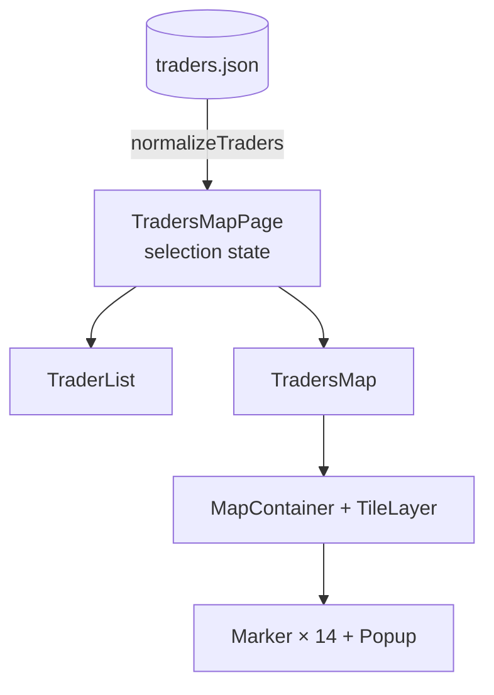

# Task 3 — Map of EGIC Traders

Route: `/map` · Code: [`src/features/traders-map/`](../src/features/traders-map/), [`src/pages/TradersMapPage.tsx`](../src/pages/TradersMapPage.tsx)

## 1. Requirements → what was built

| Requirement | Implementation |
| --- | --- |
| Locations with id, name, latitude, longitude | The 14 traders provided in the assignment, kept verbatim in [`data/traders.json`](../src/features/traders-map/data/traders.json) and mapped to `{ id, name, lat, lng }` |
| Any mapping library, mention API key requirements | **Leaflet + OpenStreetMap tiles. No API key needed.** |
| A marker per location | 14 markers. The map opens zoomed to fit all of them. |
| Clicking a marker shows a popup with the name | Popup with the Arabic name (right-to-left), trader code and an "Open in Google Maps" link |
| Side list of all locations | Scrollable list: sidebar on desktop, below the map on mobile |
| Clicking a list item centers/zooms the map and opens the popup | The map flies to the marker (zoom 15), **then** opens the popup |
| Map and list stay in sync | Two-way: the list highlights the marker's trader and scrolls to it; the marker turns red when chosen from the list. Closing the popup or pressing "Show all" clears the selection. |

## 2. Design



### One piece of shared state

```ts
type Selection = { id: number; source: 'list' | 'map' } | null
```

The page owns `selection`. Both children read it and report user actions up to the page.


**Why record `source`:** the same selection needs different behaviour depending on where it came from. A list click must move the map. A marker click must not, because the user is already looking at that marker and a camera jump would be jarring. A new object is created on every click, so clicking the same list item again re-centres the map.

## 3. Technical details

### Data
- `traders.json` keeps the exact format provided (`SAL_CODE`, `SHOP_NAME`, `LATITUDE`, `LONGITUDE`).
- [`normalizeTraders`](../src/features/traders-map/lib/traders.ts) converts it to the app's shape (`id`, `name`, `lat`, `lng`) in **one place**, trims names, and **skips records with missing or out-of-range coordinates** instead of letting one bad row break the map.
- It runs once when the page module loads, because the data is static.

### Map ([`TradersMap.tsx`](../src/features/traders-map/components/TradersMap.tsx))
- `MapContainer` gets `bounds` built from every trader plus padding, so the map fits all markers whatever the screen size. There is no hard-coded center or zoom.
- Tiles: `https://tile.openstreetmap.org/{z}/{x}/{y}.png` with the required OSM attribution.
- **Pins:** one authored SVG pin (`L.divIcon`) in the brand blue. This also avoids Leaflet's default PNG icons, which break once Vite renames assets.
- **Pin states are CSS classes, not icon swaps:** an effect toggles `is-hovered` / `is-selected` on each marker's existing element. Swapping icons would replace the DOM node and kill any transition; toggling classes lets the pin animate. Leaflet positions the outer element with transforms, so all motion lives on the inner body, scaled from the pin's tip.
  - Hover: lifts 3px and grows 14%, with a deeper shadow.
  - Selected: grows 32% in the warm signal colour, with a ground ring that pings twice.
  - `zIndexOffset` puts the selected and hovered pins above the others.
- **Hover sync:** hovering a list row lifts its pin, and hovering a pin highlights its row. This previews the link between them before anything is clicked.
- **Popups** open from their tip (scale and rise, 260 ms), and Leaflet's zoom control and popups are restyled from the app palette.
- Marker instances are stored in a `ref` `Map<id, L.Marker>` via ref callbacks, so the map can call `openPopup()` on a specific marker.
- **List → map effect:**
  1. `map.once('moveend', openPopup)`, then `map.flyTo(latlng, max(currentZoom, 15), { duration: 0.8 })`.
  2. The popup opens **after** the flight. Opening it mid-flight would trigger Leaflet's popup auto-pan, which interrupts the animation.
  3. The effect cleanup removes the pending `moveend` handler, so if the user clicks another trader during a flight, only the latest popup opens.
  4. The effect doesn't call `closePopup()` first. Leaflet closes the previous popup when the next one opens, and closing early would fire `popupclose` and wrongly clear the selection when the same trader is clicked twice.
- **"Show all"** clears the selection (which also cancels a pending popup), closes popups, and flies back to the full bounds.
- The map wrapper uses `isolate`. Leaflet uses z-indexes up to 1000, and the new stacking context keeps them below the sticky page header.

### List ([`TraderList.tsx`](../src/features/traders-map/components/TraderList.tsx))
- Items are `<button>`s (keyboard and screen-reader accessible). The selected item has `aria-current` and a highlight.
- **Map → list scrolling:** when the selection changes, the list scrolls **its own container** to centre the item, and only when the item is out of view. `element.scrollIntoView()` isn't used because it also scrolls the page, which on mobile would pull the map off-screen just as the user tapped a marker.
- Names are shown right-to-left (`dir="rtl"`), with the trader code and coordinates underneath.

### Responsive layout ([`TradersMapPage.tsx`](../src/pages/TradersMapPage.tsx))
- ≥1024px: a two-column grid, `22rem` list + map, filling the viewport height (`100dvh - header`) with a minimum height. The list scrolls on its own.
- <1024px: the map comes first (55vh, min 20rem) and the list follows. Tapping a list item smoothly scrolls the page back up to the map (`scroll-margin` accounts for the sticky header), so the user sees the map fly to the marker.

## 4. Decisions and why

| Decision | Choice | Why | Alternatives considered |
| --- | --- | --- | --- |
| Map library | **Leaflet + react-leaflet** | Free, open source, no API key or billing account. Mature and small (~40 KB gzipped for Leaflet). react-leaflet wraps it in React components while still exposing the `L.Map` instance for imperative calls like `flyTo`. | **Google Maps**: needs an API key and a billing account. **Mapbox GL**: needs a token and is a heavier WebGL library. Neither adds anything needed for 14 pins. |
| Tiles | **OpenStreetMap standard tiles** | No key, and they show Egyptian place names. Fine for a demo under OSM's tile usage policy. | Commercial tile providers (keys). For heavy production traffic, switch the `TileLayer` URL to a paid provider; that's a one-line change. |
| Data format | **Keep the provided JSON unchanged + a normalise function** | The file matches the source exactly, so it's easy to swap for a real API. The rest of the app uses clean names (`lat`, `lng`) and never needs to change. | Rewriting the JSON by hand into a new shape: harder to keep in sync with the real source. |
| Shared state | **A `selection` object with `source`**, owned by the page | One source of truth for both panels. `source` removes the ambiguity between "move the map" and "just highlight". | **Separate states** in the list and map, synchronised through events: easy to get into loops or drift. **A global store**: overkill for one value on one page. |
| Popup timing | Open on `moveend` after `flyTo` | A smooth animation with no interruption, and the popup lands where the user is looking. | Opening immediately: auto-pan fights the fly animation. |
| Flying vs jumping | `flyTo` with a 0.8s duration | The animation shows the user *where* the trader is relative to where they were. | `setView`: an instant jump that loses spatial context. |
| Marker states | Custom SVG `divIcon` + classes toggled on the live element | Hover and selection animate smoothly, since the element is never replaced. The warm selection colour stands out against both the blue UI and the map's water. | Swapping `L.icon` per state: an instant swap with no transition. A CSS hue filter on the PNG: worked, but couldn't animate or match the palette. |
| List selection | One highlight element that slides between rows | A selection made on the map is visibly followed through the list, instead of jumping from row to row. | Per-row background: correct, but loses the sense of motion between selections. |
| List scrolling | Scroll the list container only | Avoids the page jumping on mobile. | `scrollIntoView`, which moves the page too. |
| Search/filter | **Not added** | 14 items fit on screen, and the task didn't ask for it. Avoiding over-engineering. | A search box, worth adding if the list grows to hundreds (and marker clustering along with it). |
| Extra popup link | "Open in Google Maps" | One line that answers the next thing a user wants: directions to the trader. | — |

## 5. Testing

| File | What it proves |
| --- | --- |
| `lib/traders.test.ts` | All 14 provided records map to `{id, name, lat, lng}`; invalid coordinates (out of range, NaN) are skipped |

Checked by hand in the browser at desktop and 375px widths:
- 14 markers and 14 list items render, and tiles load.
- Clicking a marker opens its popup, turns the marker red and highlights the list item.
- Clicking a list item flies the map there and opens the right popup. On mobile the page scrolls back to the map.
- Clicking the same item twice keeps the selection. "Show all" clears the selection and closes popups.
- No horizontal overflow at 375px.

## 6. Assumptions and limitations

- Uses the real data provided in the assignment. `SAL_CODE` is used as the unique `id`.
- Needs internet access for map tiles.
- Two traders (4220 and 4221) are about 800 m apart, so at country-level zoom their pins overlap. Selecting either from the list zooms in far enough to tell them apart. Clustering wasn't added for 14 points.
