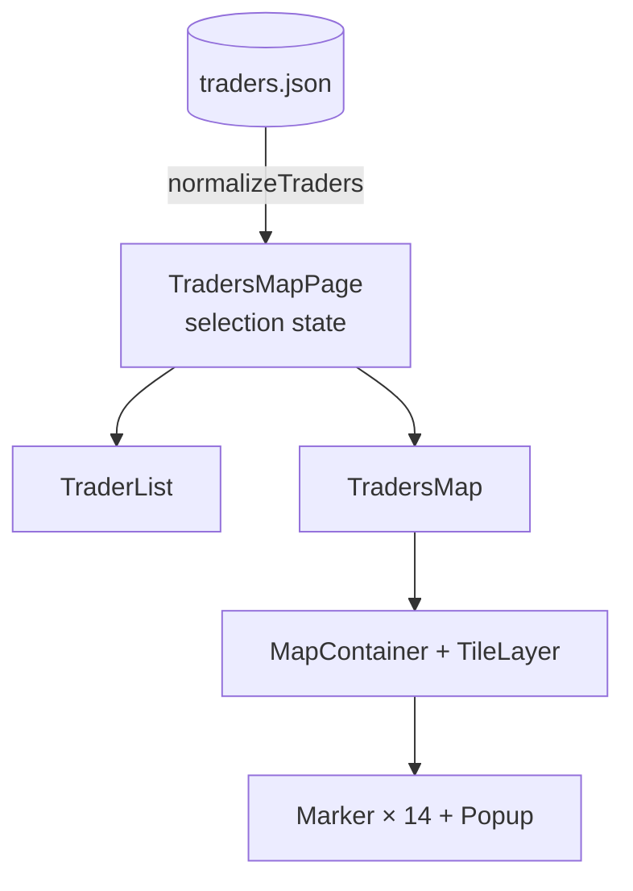
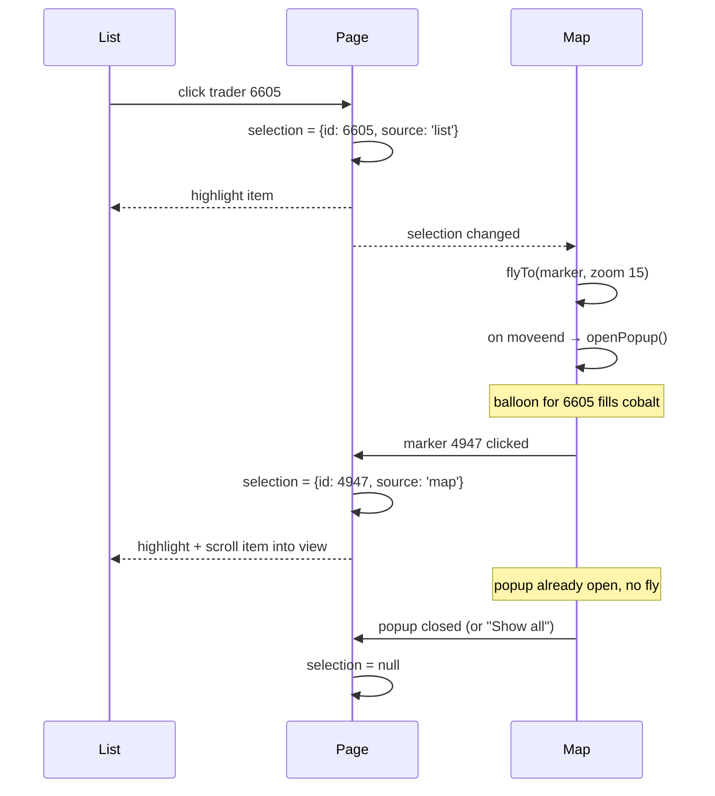

# Task 3 — Map of EGIC Traders

Route: `/map` · Code: [`src/features/traders-map/`](../src/features/traders-map/), [`src/pages/TradersMapPage.tsx`](../src/pages/TradersMapPage.tsx) · Visual system: [DESIGN.md](../DESIGN.md)

## 1. Requirements → what was built

| Requirement | Implementation |
| --- | --- |
| Locations with id, name, latitude, longitude | The 14 traders provided in the assignment, kept verbatim in [`data/traders.json`](../src/features/traders-map/data/traders.json) and mapped to `{ id, name, lat, lng }` |
| Any mapping library, mention API key requirements | **Leaflet + OpenStreetMap tiles. No API key needed.** |
| A marker per location | 14 numbered balloon markers. The map opens zoomed to fit all of them. |
| Clicking a marker shows a popup with the name | Popup with the balloon number, trader code, Arabic name (right-to-left), coordinates and a "Directions in Google Maps" link |
| Side list of all locations | The **trader register**: numbered rows with name, code and coordinates; beside the map on desktop, below it on mobile |
| Clicking a list item centers/zooms the map and opens the popup | The map flies to the marker (zoom 15), **then** opens the popup |
| Map and list stay in sync | Two-way and numbered: markers are balloons carrying the register row number; the register highlights and scrolls to a clicked balloon; a chosen row flies the map there and fills its balloon cobalt; hover previews the link both ways. Closing the popup or pressing "Show all" clears the selection. |

## 2. Design

### The sheet

```
TRADERS MAP                                        ┌Locations┬Selected──────────┐
brief…                                             │   14    │ (trader name)    │
                                                   └─────────┴──────────────────┘
TRADER REGISTER   No. · Name · Lat, Lng   ┌──────────────────────────────────────┐
① ايهاب سعيد …           28.6503, 30.8395  │ [+][-]                   [⛶ Show all]│
② ناصر ابو خطوه          30.1479, 31.3533  │        ④   ⑦⑭                        │
█ ③ selected (cobalt band) ████████████████ │           ⑫  ⑩                       │
…                                          │        ②        ⑪                    │
                                           │     ①                                │
                                           └──────────────────────────────────────┘
```

The page follows the toolkit's **product data sheet** world ([DESIGN.md](../DESIGN.md)). Its key device is the **numbered balloon** from technical drawings: each marker is a balloon on a leader line carrying the same number as its register row, so a location and its trader are matched by number, without reading small Arabic names at map scale. The register is a ruled list with one cobalt selection band; the map sits in an ink frame with square controls.

### Structure



### One piece of shared state

```ts
type Selection = { id: number; source: 'list' | 'map' } | null
```

The page owns `selection`. Both children read it and report user actions up to the page.



**Why record `source`:** the same selection needs different behaviour depending on where it came from. A list click must move the map. A marker click must not, because the user is already looking at that marker and a camera jump would be jarring. A new object is created on every click, so clicking the same list item again re-centres the map.

## 3. Technical details

### Data
- `traders.json` keeps the exact format provided (`SAL_CODE`, `SHOP_NAME`, `LATITUDE`, `LONGITUDE`).
- [`normalizeTraders`](../src/features/traders-map/lib/traders.ts) converts it to the app's shape (`id`, `name`, `lat`, `lng`) in **one place**, trims names, and **skips records with missing or out-of-range coordinates** instead of letting one bad row break the map.
- It runs once when the page module loads, because the data is static.

### Map ([`TradersMap.tsx`](../src/features/traders-map/components/TradersMap.tsx))
- `MapContainer` gets `bounds` built from every trader plus padding, so the map fits all markers whatever the screen size. There is no hard-coded center or zoom.
- Tiles: `https://tile.openstreetmap.org/{z}/{x}/{y}.png` with the required OSM attribution.
- **Markers are numbered balloons on leader lines** (`L.divIcon`): the technical-drawing convention for "item N is here", matching the number in the trader register. This is the sheet's cross-reference device ([DESIGN.md](../DESIGN.md)) and avoids Leaflet's default PNG icons, which break once Vite renames assets. Icon objects are memoised per trader so react-leaflet never replaces the element.
- **Marker states are CSS classes, not icon swaps:** an effect toggles `is-hovered` / `is-selected` on each marker's existing element, so states animate. Leaflet positions the outer element with transforms; all motion lives on the inner body, scaled from the leader's foot.
  - Hover: lifts 3px and turns cobalt.
  - Selected: grows 18%, the balloon fills cobalt, and a ground ring pings twice.
  - `zIndexOffset` puts the selected and hovered markers above the others.
- **Hover sync:** hovering a register row lifts its balloon, and hovering a balloon highlights its row — the link is previewed before anything is clicked.
- **Popups** open from their tip (scale and rise, 240 ms), square with an ink rule, and repeat the balloon number, trader code and coordinates. Leaflet's zoom control is restyled as an ink-outlined square control.
- Marker instances are stored in a `ref` `Map<id, L.Marker>` via ref callbacks, so the map can call `openPopup()` on a specific marker.
- **List → map effect:**
  1. `map.once('moveend', openPopup)`, then `map.flyTo(latlng, max(currentZoom, 15), { duration: 0.8 })`.
  2. The popup opens **after** the flight. Opening it mid-flight would trigger Leaflet's popup auto-pan, which interrupts the animation.
  3. The effect cleanup removes the pending `moveend` handler, so if the user clicks another trader during a flight, only the latest popup opens.
  4. The effect doesn't call `closePopup()` first. Leaflet closes the previous popup when the next one opens, and closing early would fire `popupclose` and wrongly clear the selection when the same trader is clicked twice.
- **"Show all"** clears the selection (which also cancels a pending popup), closes popups, and flies back to the full bounds.
- The map wrapper uses `isolate`. Leaflet uses z-indexes up to 1000, and the new stacking context keeps them below the sticky page header.

### List ([`TraderList.tsx`](../src/features/traders-map/components/TraderList.tsx))
- Items are `<button>`s (keyboard and screen-reader accessible). The selected item has `aria-current` and a highlight.
- **Map → list scrolling:** when the selection changes, the list scrolls **its own container** to centre the item, and only when the item is out of view. `element.scrollIntoView()` isn't used because it also scrolls the page, which on mobile would pull the map off-screen just as the user tapped a marker.
- Names are shown right-to-left (`dir="rtl"`), with the trader code and coordinates underneath.

### Responsive layout ([`TradersMapPage.tsx`](../src/pages/TradersMapPage.tsx))
- ≥1024px: a two-column grid, `23rem` register + map, filling the viewport height below the sheet header, with a minimum height. The register scrolls on its own.
- <1024px: the map comes first (58vh, min 20rem) and the register follows. Tapping a list item smoothly scrolls the page back up to the map (`scroll-margin` accounts for the sticky header), so the user sees the map fly to the marker.

## 4. Decisions and why

| Decision | Choice | Why | Alternatives considered |
| --- | --- | --- | --- |
| Map library | **Leaflet + react-leaflet** | Free, open source, no API key or billing account. Mature and small (~40 KB gzipped for Leaflet). react-leaflet wraps it in React components while still exposing the `L.Map` instance for imperative calls like `flyTo`. | **Google Maps**: needs an API key and a billing account. **Mapbox GL**: needs a token and is a heavier WebGL library. Neither adds anything needed for 14 pins. |
| Tiles | **OpenStreetMap standard tiles** | No key, and they show Egyptian place names. Fine for a demo under OSM's tile usage policy. | Commercial tile providers (keys). For heavy production traffic, switch the `TileLayer` URL to a paid provider; that's a one-line change. |
| Data format | **Keep the provided JSON unchanged + a normalise function** | The file matches the source exactly, so it's easy to swap for a real API. The rest of the app uses clean names (`lat`, `lng`) and never needs to change. | Rewriting the JSON by hand into a new shape: harder to keep in sync with the real source. |
| Shared state | **A `selection` object with `source`**, owned by the page | One source of truth for both panels. `source` removes the ambiguity between "move the map" and "just highlight". | **Separate states** in the list and map, synchronised through events: easy to get into loops or drift. **A global store**: overkill for one value on one page. |
| Popup timing | Open on `moveend` after `flyTo` | A smooth animation with no interruption, and the popup lands where the user is looking. | Opening immediately: auto-pan fights the fly animation. |
| Flying vs jumping | `flyTo` with a 0.8s duration | The animation shows the user *where* the trader is relative to where they were. | `setView`: an instant jump that loses spatial context. |
| Marker design | **Numbered balloon on a leader line**, number = register row | Staff match a location to its trader by number without reading Arabic names at map scale; the same device cross-references fields on the ID reader, so the toolkit teaches one convention. | Teardrop pins (no cross-reference); colour-coded pins (colour is reserved for action/selection). |
| Marker states | Classes toggled on the live element | Hover and selection animate smoothly, since the element is never replaced. | Swapping icons per state: an instant swap with no transition. |
| List selection | One cobalt band that slides between rows | A selection made on the map is visibly followed through the register, instead of jumping from row to row. | Per-row background: correct, but loses the sense of motion between selections. |
| List scrolling | Scroll the list container only | Avoids the page jumping on mobile. | `scrollIntoView`, which moves the page too. |
| Search/filter | **Not added** | 14 items fit on screen, and the task didn't ask for it. Avoiding over-engineering. | A search box, worth adding if the list grows to hundreds (and marker clustering along with it). |
| Extra popup link | "Directions in Google Maps" (SVG external-link icon, opens a new tab) | One line that answers the next thing staff need: how to get to the trader. | — |
| Visual form | Ruled register + ink-framed map, cobalt only for selection | Consistent with the other two sheets; selection is the only thing that needs colour on this page. | Card list with coloured pins (the previous, generic look). |

## 5. Testing

| File | What it proves |
| --- | --- |
| `lib/traders.test.ts` | All 14 provided records map to `{id, name, lat, lng}`; invalid coordinates (out of range, NaN) are skipped |

Checked by hand in the browser at desktop and 375px widths:
- 14 numbered balloons and 14 register rows render with matching numbers, and tiles load.
- Hovering a register row lifts its balloon; hovering a balloon highlights its row.
- Clicking a balloon opens its popup, fills the balloon cobalt and highlights the register row with the same number.
- Clicking a list item flies the map there and opens the right popup. On mobile the page scrolls back to the map.
- Clicking the same item twice keeps the selection. "Show all" clears the selection and closes popups.
- No horizontal overflow at 375px.

## 6. Assumptions and limitations

- Uses the real data provided in the assignment. `SAL_CODE` is used as the unique `id`.
- Needs internet access for map tiles.
- Two traders (4220 and 4221) are about 800 m apart, so at country-level zoom their balloons overlap. Selecting either from the list zooms in far enough to tell them apart. Clustering wasn't added for 14 points.
