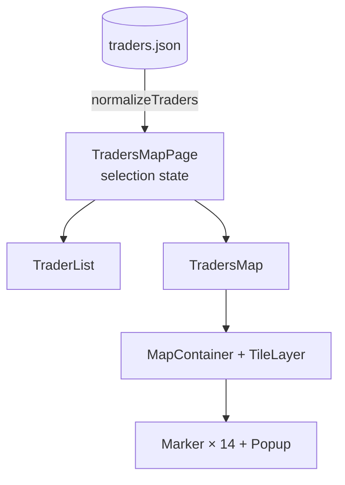

# Task 3 — Map of EGIC Traders

Route: `/map` · Code: [`src/features/traders-map/`](../src/features/traders-map/), [`src/pages/TradersMapPage.tsx`](../src/pages/TradersMapPage.tsx) · Visual system: [DESIGN.md](../DESIGN.md)

## 1. Requirements → what was built

| Requirement | Implementation |
| --- | --- |
| Locations with id, name, latitude, longitude | The 14 traders provided in the assignment, kept verbatim in [`data/traders.json`](../src/features/traders-map/data/traders.json) and mapped to `{ id, name, lat, lng }` |
| Any mapping library, mention API key requirements | **Leaflet + OpenStreetMap tiles. No API key needed.** |
| A marker per location | 14 numbered water-drop markers. The map opens zoomed to fit all of them. |
| Clicking a marker shows a popup with the name | Popup with the marker number, trader code, Arabic name (right-to-left), coordinates and a "Directions in Google Maps" link |
| Side list of all locations | The **trader list**: numbered rows with name, code and coordinates; beside the map on desktop, below it on mobile |
| Clicking a list item centers/zooms the map and opens the popup | The map flies to the marker (zoom 15), **then** opens the popup |
| Map and list stay in sync | Two-way and numbered: each marker carries its list row number; the list highlights and scrolls to a clicked marker; a chosen row flies the map there and enlarges its marker; hover previews the link both ways. Closing the popup or pressing "Show all" clears the selection. |

## 2. Design

### The page

```
╭──────────────────────────────────────────────────────────────────────────────╮
│ Traders Map                                           ┄┄③┄┄╮  street grid   │
│ brief…                                                  ②   with drop pins │
│ (Locations 14) (Selected: trader name)                                      │
╰──────────────────────────────────────────────────────────────────────────────╯
╭ (⌖) Traders     14 traders ╮  ╭──────────────────────────────────────────────╮
│ ① ايهاب سعيد …              │  │ [+][-]                        (⛶ Show all)  │
│   Trader 5405  28.65, 30.84 │  │        ④   ⑦⑭                                │
│╭ ③ selected (orange band) ─╮│  │           ⑫  ⑩                               │
│╰───────────────────────────╯│  │        ②        ⑪                            │
│ …                           │  │     ①                                        │
╰─────────────────────────────╯  ╰──────────────────────────────────────────────╯
```

The page follows the toolkit's **Pipe Colour Code** world ([DESIGN.md](../DESIGN.md)) and runs on **hot-water orange**. Its key device is the **numbered water drop**: each marker is an orange drop carrying the same number as its list row, so a location and its trader are matched by number, without reading small Arabic names at map scale. The same numbered-tag convention links fields on the ID reader, so the toolkit teaches it once. The list and map are soft panels; the list has one rounded orange selection band, and the map's controls are rounded and float over the tiles. In dark mode the same street tiles are re-toned to sit on the navy canvas.

### Structure



### One piece of shared state

```ts
type Selection = { id: number; source: 'list' | 'map' } | null
```

The page owns `selection`. Both children read it and report user actions up to the page.


**Why record `source`:** the same selection needs different behaviour depending on where it came from. A list click must move the map. A marker click must not, because the user is already looking at that marker and a camera jump would be jarring. A new object is created on every click, so clicking the same list item again re-centres the map.

## 3. Technical details

### Data
- `traders.json` keeps the exact format provided (`SAL_CODE`, `SHOP_NAME`, `LATITUDE`, `LONGITUDE`).
- [`normalizeTraders`](../src/features/traders-map/lib/traders.ts) converts it to the app's shape (`id`, `name`, `lat`, `lng`) in **one place**, trims names, and **skips records with missing or out-of-range coordinates** instead of letting one bad row break the map.
- It runs once when the page module loads, because the data is static.

### Map ([`TradersMap.tsx`](../src/features/traders-map/components/TradersMap.tsx))
- `MapContainer` gets `bounds` built from every trader plus padding, so the map fits all markers whatever the screen size. There is no hard-coded center or zoom.
- Tiles: `https://tile.openstreetmap.org/{z}/{x}/{y}.png` with the required OSM attribution. In light mode the tile layer is slightly desaturated so the orange markers lead; in dark mode a CSS filter (`invert` + `hue-rotate(180deg)`, then desaturate and dim) turns the same tiles into a navy street map. It is pure CSS on `.leaflet-tile-pane`, so switching theme needs no reload of the tiles.
- **Markers are numbered water drops** (`L.divIcon` with an inline SVG): a drop in the traders' pipe colour with a surface-coloured circle holding the list number. This is the toolkit's cross-reference device ([DESIGN.md](../DESIGN.md)) and avoids Leaflet's default PNG icons, which break once Vite renames assets. The SVG uses `currentColor` and CSS variables, so it follows the theme. Icon objects are memoised per trader so react-leaflet never replaces the element.
- **Marker states are CSS classes, not icon swaps:** an effect toggles `is-hovered` / `is-selected` on each marker's existing element, so states animate. Leaflet positions the outer element with transforms; all motion lives on the inner body, scaled from the drop's tip.
  - Hover: lifts 3px and grows 10%.
  - Selected: grows 25%, deepens its orange, and a ground ring pings twice.
  - `zIndexOffset` puts the selected and hovered markers above the others.
- **Hover sync:** hovering a list row lifts its marker, and hovering a marker highlights its row, so the link is previewed before anything is clicked.
- **Popups** open from their tip (scale and rise, 240 ms) as rounded surface cards with the lifted shadow, and repeat the marker number (a solid orange tag), trader code and coordinates. Leaflet's zoom control is restyled as a rounded control on the app's surface colours. These overrides are scoped under `.leaflet-container` because Leaflet's own stylesheet loads after the app's and would otherwise win (the popup stayed white in dark mode before this).
- Marker instances are stored in a `ref` `Map<id, L.Marker>` via ref callbacks, so the map can call `openPopup()` on a specific marker.
- **List → map effect:**
  1. `map.once('moveend', openPopup)`, then `map.flyTo(latlng, max(currentZoom, 15), { duration: 0.8 })`.
  2. The popup opens **after** the flight. Opening it mid-flight would trigger Leaflet's popup auto-pan, which interrupts the animation.
  3. The effect cleanup removes the pending `moveend` handler, so if the user clicks another trader during a flight, only the latest popup opens.
  4. The effect doesn't call `closePopup()` first. Leaflet closes the previous popup when the next one opens, and closing early would fire `popupclose` and wrongly clear the selection when the same trader is clicked twice.
- **"Show all"** clears the selection (which also cancels a pending popup), closes popups, and flies back to the full bounds.
- The map wrapper uses `isolate`. Leaflet uses z-indexes up to 1000, and the new stacking context keeps them below the sticky page header.

### List ([`TraderList.tsx`](../src/features/traders-map/components/TraderList.tsx))
- Items are `<button>`s (keyboard and screen-reader accessible). The selected item has `aria-current` and a highlight.
- **Map → list scrolling:** when the selection changes, the list scrolls **its own container** to centre the item, and only when the item is out of view. `element.scrollIntoView()` isn't used because it also scrolls the page, which on mobile would pull the map off-screen just as the user tapped a marker.
- Names are shown right-to-left (`dir="rtl"`), with the trader code and coordinates underneath.

### Responsive layout ([`TradersMapPage.tsx`](../src/pages/TradersMapPage.tsx))
- ≥1024px: a two-column grid, `23rem` list + map, filling the viewport height below the page header, with a minimum height. The list scrolls on its own.
- <1024px: the map comes first (58vh, min 20rem) and the list follows. Tapping a list item smoothly scrolls the page back up to the map (`scroll-margin` accounts for the sticky header), so the user sees the map fly to the marker.

## 4. Decisions and why

| Decision | Choice | Why | Alternatives considered |
| --- | --- | --- | --- |
| Map library | **Leaflet + react-leaflet** | Free, open source, no API key or billing account. Mature and small (~40 KB gzipped for Leaflet). react-leaflet wraps it in React components while still exposing the `L.Map` instance for imperative calls like `flyTo`. | **Google Maps**: needs an API key and a billing account. **Mapbox GL**: needs a token and is a heavier WebGL library. Neither adds anything needed for 14 pins. |
| Tiles | **OpenStreetMap standard tiles, re-toned with CSS for dark mode** | No key, and they show Egyptian place names. Fine for a demo under OSM's tile usage policy. One tile set for both themes means nothing reloads when the theme changes. | **CARTO Voyager / Dark Matter**: tried during the redesign, but their tiles now show an "API key required" watermark. Other commercial providers need keys. For heavy production traffic, switch the `TileLayer` URL to a paid provider; that's a one-line change. |
| Data format | **Keep the provided JSON unchanged + a normalise function** | The file matches the source exactly, so it's easy to swap for a real API. The rest of the app uses clean names (`lat`, `lng`) and never needs to change. | Rewriting the JSON by hand into a new shape: harder to keep in sync with the real source. |
| Shared state | **A `selection` object with `source`**, owned by the page | One source of truth for both panels. `source` removes the ambiguity between "move the map" and "just highlight". | **Separate states** in the list and map, synchronised through events: easy to get into loops or drift. **A global store**: overkill for one value on one page. |
| Popup timing | Open on `moveend` after `flyTo` | A smooth animation with no interruption, and the popup lands where the user is looking. | Opening immediately: auto-pan fights the fly animation. |
| Flying vs jumping | `flyTo` with a 0.8s duration | The animation shows the user *where* the trader is relative to where they were. | `setView`: an instant jump that loses spatial context. |
| Marker design | **Numbered water drop** in the traders' orange, number = list row | Staff match a location to its trader by number without reading Arabic names at map scale; the same numbered tags cross-reference fields on the ID reader, so the toolkit teaches one convention. The drop shape ties the pin to EGIC's water business. | Leaflet's default pins (no number, and the PNGs break under Vite); a different colour per trader (colour already means "which tool"). |
| Marker states | Classes toggled on the live element | Hover and selection animate smoothly, since the element is never replaced. | Swapping icons per state: an instant swap with no transition. |
| List selection | One rounded orange band that slides between rows | A selection made on the map is visibly followed through the list, instead of jumping from row to row. | Per-row background: correct, but loses the sense of motion between selections. |
| List scrolling | Scroll the list container only | Avoids the page jumping on mobile. | `scrollIntoView`, which moves the page too. |
| Search/filter | **Not added** | 14 items fit on screen, and the task didn't ask for it. Avoiding over-engineering. | A search box, worth adding if the list grows to hundreds (and marker clustering along with it). |
| Extra popup link | "Directions in Google Maps" (SVG external-link icon, opens a new tab) | One line that answers the next thing staff need: how to get to the trader. | — |
| Visual form | Soft list and map panels in hot-water orange, with a street-grid illustration | Consistent with the other two tools: the colour says which tool you are in, and the numbered drops carry the list ↔ map link. | The earlier ruled register and ink-framed map (too austere). |

## 5. Testing

| File | What it proves |
| --- | --- |
| `lib/traders.test.ts` | All 14 provided records map to `{id, name, lat, lng}`; invalid coordinates (out of range, NaN) are skipped |

Checked by hand in the browser at desktop and 375px widths, in light and dark:
- 14 numbered markers and 14 list rows render with matching numbers, and tiles load (re-toned in dark mode).
- Hovering a list row lifts its marker; hovering a marker highlights its row.
- Clicking a marker opens its popup, enlarges the marker and highlights the list row with the same number. The popup follows the theme.
- Clicking a list item flies the map there and opens the right popup. On mobile the page scrolls back to the map.
- Clicking the same item twice keeps the selection. "Show all" clears the selection and closes popups.
- No horizontal overflow at 375px.

## 6. Assumptions and limitations

- Uses the real data provided in the assignment. `SAL_CODE` is used as the unique `id`.
- Needs internet access for map tiles.
- Two traders (4220 and 4221) are about 800 m apart, so at country-level zoom their markers overlap. Selecting either from the list zooms in far enough to tell them apart. Clustering wasn't added for 14 points.
