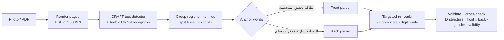

# EGIC ID reader — local deep-learning service

A small FastAPI service that reads Egyptian national ID cards (front, back, or both on one page; photo or PDF) with pretrained deep-learning OCR models running on your own machine. The web app's **Local model** engine calls it through Vite's proxy at `/api/ml`.

Nothing is stored: uploads are processed in memory and discarded with the response.

## Run it

Requires **Python 3.10–3.12**. A CUDA GPU is optional (≈3 s per two-sided page on an RTX 3060; CPU works, several times slower).

```bash
cd ml-service
python -m venv .venv
# Windows: .venv\Scripts\activate    macOS/Linux: source .venv/bin/activate

# 1) PyTorch for your hardware — NVIDIA GPU (CUDA 12.8 wheels):
pip install torch torchvision --index-url https://download.pytorch.org/whl/cu128
#    …or CPU only:
# pip install torch torchvision --index-url https://download.pytorch.org/whl/cpu

# 2) Everything else
pip install -r requirements.txt

# 3) Start (first start downloads EasyOCR's pretrained weights, ~100 MB, once)
python -m uvicorn app.main:app --host 127.0.0.1 --port 8008
```

Then run the web app (`npm run dev` in the project root) and open `/national-id`: the engine register shows **Local model · Running on this PC · GPU/CPU**.
To use another port or host, set `ML_SERVICE_URL` in the web app's `.env.local`.

Tests (pure parsing and layout logic, no model needed):

```bash
python -m pytest -q
```

## API

| Method | Path | Body | Returns |
| --- | --- | --- | --- |
| GET | `/health` | — | `{ status, ready, device, model, loadMs }` |
| POST | `/read` | multipart `file`: JPG / PNG / WebP / PDF, ≤ 15 MB | `sides[]` (side, cropped image, fields with value · confidence · normalised box · note), `summary`, `checks[]`, `warnings[]`, `timingsMs` |

Errors: `400` with a user-facing `detail` for unreadable or unsupported uploads, `500` with a generic message (details in the service log).

## How it reads a card



| Stage | What happens | Where |
| --- | --- | --- |
| Documents | PDFs rendered with PyMuPDF (first 2 pages, 250 DPI); photos decoded with OpenCV and capped at 3000 px | `app/documents.py` |
| Deep learning | EasyOCR: **CRAFT** (a convolutional text-region detector) finds every text region; a **CRNN** (CNN + BiLSTM + CTC) trained on Arabic reads each one. Arabic + English models load once and run on CUDA when available | `app/ocr.py` |
| Layout | Regions whose vertical extents overlap become lines; a vertical gap over 3× the median line height starts a new card; anchor words classify each card as front or back | `app/layout.py` |
| Fields | Front: name (two lines after the header), address (lines before the number), 14-digit ID, Latin card number. Back: ID + issue date, profession lines, gender/religion/marital status, expiry | `app/pipeline.py` |
| Repairs | ID digit groups tried in both orders (the RTL recognizer reverses them) plus a digits-only re-read; dates parsed knowing the model reads "/" as "١"; enlarged re-reads of weak lines; single-letter repair of the four most frequent given names below 95 % confidence; split house numbers rejoined | `app/fields.py` |
| Checks | ID structure (century, real birth date, governorate), front ↔ back number match, gender word ↔ 13th digit, card validity; expiry preferred when it equals issue year + 7 | `app/pipeline.py`, `app/national_id.py` |

## Measured

Tested on one real two-sided card (a phone photo pasted into a PDF, patterned background) during development:

| Engine | ID number | Name | Back fields | Time |
| --- | --- | --- | --- | --- |
| Tesseract.js (ara), on a clean synthetic card | not read (zero digits dropped, Latin lookalikes) | 1 of 2 lines | — (front only) | not timed |
| This service, single pass | correct after group reordering | last letter of 2 words wrong | 4 of 6, dates garbled | 2.0 s |
| This service, full pipeline | **correct on both sides** | **correct** (1 repair, shown to the user) | **6 of 6** incl. both dates | 2.8 s |

Honest limits: one real sample is not a benchmark. The heuristics are generic (they encode the card's printed layout, not that card), but accuracy on other photos — glare, rotation, older card designs — is unmeasured. Rotated photos are not deskewed. The next step for production would be a labelled set of cards and a small fine-tuned field detector.
